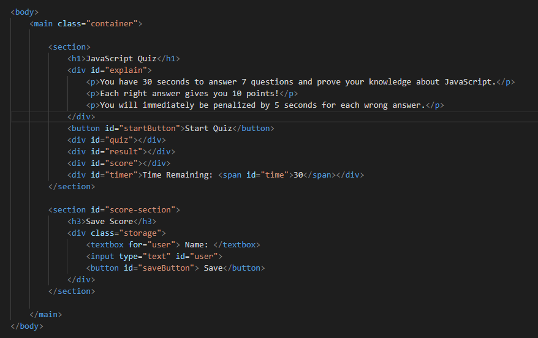

# JavaScript / Web APIs: JavaScript Quiz

## Description
This webpage has been developed from scratch as a homework challenge, which aims to create a quiz about JavaScript subjects to test users' knowledge and compare their scores.

The development of this webiste required a lot of research from me to suit the requirements and ensure that the data will be saved properly.

Using the DOM method and creating just a small HTML document and working by calling the elements by 'id' was the most interesting lesson learned while developing this code.

Therefore, each new element learnt throughout each new assessment has been a great opportunity to understand and develop my Web Development skills.

## Usage
The webpage has been developed using VS Code, where the structure was created in HTML, CSS and the interaction with the end-user was developed using Javascript. 

The website is a quiz to challenge users interested in test their knowledge about JavaScript and compare their scores with their peers.

It consists in 7 questions that have to be answer by multiple choices, where each right answer scores 10 points and each wrong answer penalizes by 5 seconds the user on clock.

The image below shows the first interaction with the website, where the user is presented to the instructions and to a button to start the quiz. Also, a timer is displayed that will start a countdown as soon the button is clicked.

By clicking on the button 'Start Quiz' an event "click" will be activate, then section of question will be displayed and the user has to run against the time to try to finish answering all the questions before the time finishes and pay a lot of attention because each wrong answer will take 5 seconds from the time remaining.

Below is an illustration about how the question will be displayed.

As soon as the user finishes answering all the questions or the clock reaches the end, a screen with their scores is presented with a textbox and a button to save their scores to compare to their peers later in the localSorage.

To access the scores, open the DevTools on your browser and navigate to the tab 'Application', then look for 'Storage', followed by 'LocalStorage' and click on the file in there.

When the button 'Save' is actioned a confirm box is displayed to ensure the data was storaged and asking if you want to play again.

If you choose to play again the page will reloaded and a new quiz starts, otherwise, a new message will be displayed asking if you really want to leave the quiz. If you confirm that you do not want to play anymore, the page will be closed.

## Development & Deployment

The code to create the website was developed using Javascript, where it was possible create interaction by using events as "click" on the buttom and a group of comparisons of the data inserted to attend the acceptance criteria. 

The screenshot below shows how the HTML code has been summarized by 'id' to be called by ElementId.

The next illustration shows part of the JavaScript code and some examples of how the elements are called by ID.

To access the quiz, use the link below.

https://robinsonfdossantos.github.io/JavaScript_Quiz/

For more information, use the browser's DevTools by typing Ctrl + Shift + I.

## Credits

Members of the Bootcamp team, and in special to Meeks Gombe, Dominique who helped me to understand and overcome all my doubts through a 1:1 tutor session.

## License

Licensed under the MIT License.
